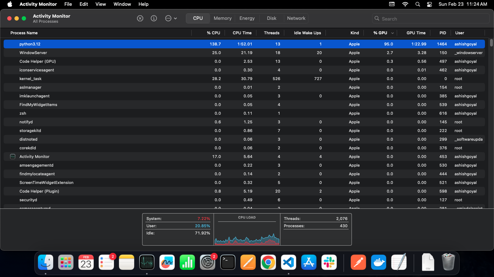
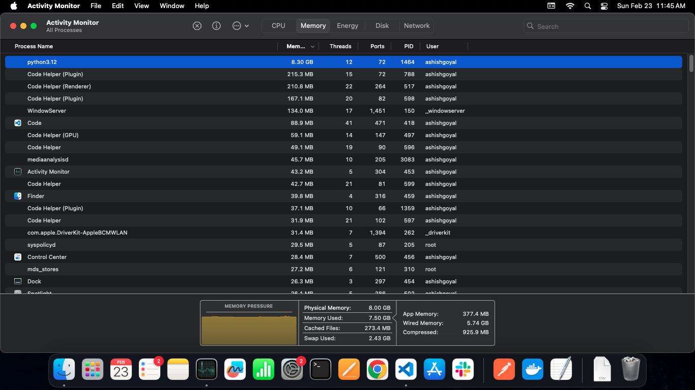

# Vanilla Transformer for English to Italian Translation

## Overview

This project involves training a vanilla transformer architecture on a Mac Mini M2 Silicon for translating English to Italian. The translation dataset used for training is the opus-books dataset from Hugging Face, consisting of 32,338 rows.

## Project Details

1. **Implementation**: Vanilla transformer implemented from scratch using PyTorch.
2. **Training Pipeline**:
   - Supports pre-load training.
   - Includes a debug mode.
   - Visualizes training loss over epochs using tqdm progress bar and TensorBoard.
3. **Inference Pipeline**: Uses greedy method to predict model outcomes on the validation dataset.
4. **Tokenizer**: Trained Hugging Face tokenizer for both source and target texts using Word Level Splitter.
5. **Data Pipeline**: 
   - Created a PyTorch data pipeline to build an iterator for the dataset for training and validation.
   - Used PyTorch DataLoader for incorporating batch dimension and shuffling.
6. **Components Notebook**: Lists items required to build and train the transformer, serving as a reference for future deep dives.
7. **Monitor Notebook**: Provides code on transformer architecture size and memory usage based on different configurations.

## Experiment / Key Takeaways

- **System**: Mac Mini M2 with 8GB unified RAM, GPU usage via MPS (an alternative to CUDA).
- **Train-Test Split**: 90:10 (29,104 training rows, 3,234 test rows).
- **Source Vocab Size**: 15,698
- **Target Vocab Size**: 22,463

### Hyper-parameters

```json
{
   "batch_size": 8,
   "num_epochs": 10,
   "lr": 10**-4,
   "seq_len": 350,
   "d_model": 512,
   "lang_src": "en",
   "lang_tgt": "it",
   "model_folder": "weights",
   "model_basename": "tmodel_",
   "preload": None,
   "tokenizer_file": "tokenizer_{0}.json",
   "experiment_name": "runs/tmodel",
   "num_layers": 3,
   "num_heads": 8,
   "d_ff": 1024,
   "dropout": 0.1,
   "debug": False,
   "run_validation_nums": 500,
}
```
## Model Parameters

- **Original Vanilla Transformer Parameter Count**: 75.1M (N=6, H=8, d_ff=2048)
- **Experiment Parameter Count**: 46.82M

## Performance

- **Training Time**: Approximately 42 minutes per epoch.
- **GPU Usage**: Over 90%
- **Memory Usage**: Approximately 7.7 GB
- **Observation**: A model with about 40 to 45M parameters can be trained on this system without significant slowness.

### System Monitoring

#### CPU/GPU Utilization


#### Memory Utilization


## Conclusion

This project demonstrates the feasibility of training a vanilla transformer model for language translation on a Mac Mini M2 Silicon. The system efficiently handles a model with around 40 to 45 million parameters, making it a viable option for similar machine learning tasks.